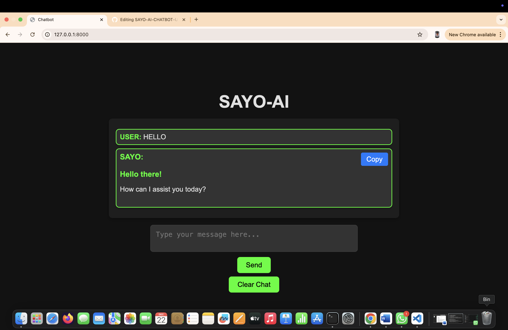
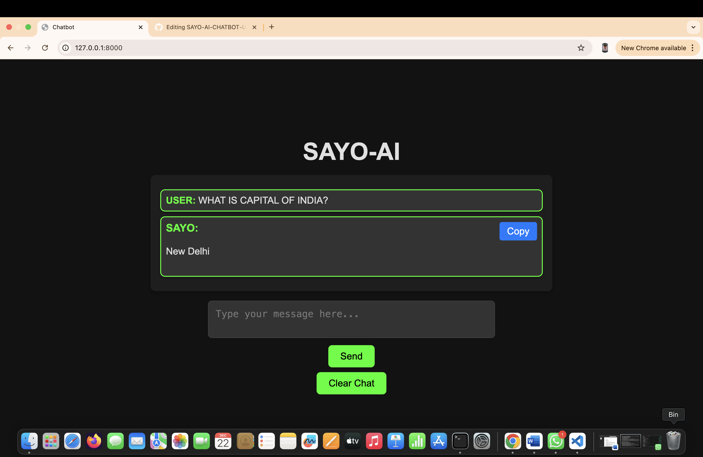
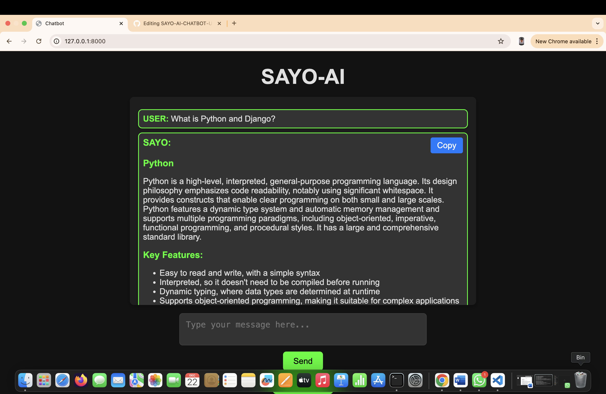
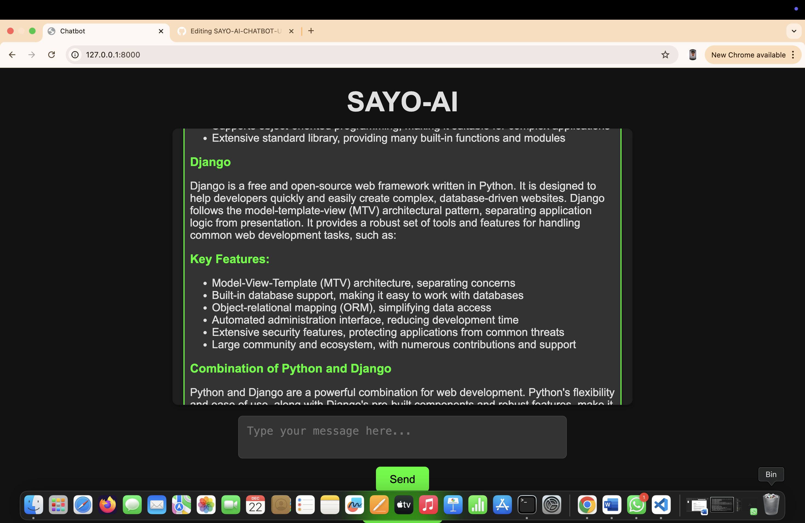

# Sayo AI Chatbot using Python & Django

## Project Description
Sayo is an AI-powered chatbot developed using Python and Django. The chatbot uses natural language processing (NLP) techniques to interact with users and answer queries. It can be integrated into websites or used as a standalone application.

## Features
- AI-powered chatbot with NLP capabilities.
- Built using Python, Django, and TensorFlow.
- Provides answers to user queries based on predefined data.
- Easy-to-deploy using Docker.
- User-friendly interface for easy interactions

## Technologies Used
- **Python**: Backend development.
- **Django**: Web framework for building the application.
- **TensorFlow**: For machine learning-based NLP.
- **SQLite**: Database for storing user interactions and chatbot data.

## Example Chatbot Interaction

### Screenshot 1:
**USER**: Hello  
**SAYO**: Hello there! How can I assist you today?

This is the initial interaction with the chatbot where the user greets it, and the chatbot responds politely, offering help.

---

### Screenshot 2:
**USER**: What is the capital of India?  
**SAYO**: New Delhi

In this example, the user asks a simple question, and the chatbot quickly provides the correct answer.

---

### Screenshot 3:
**USER**: What is Python and Django?  
**SAYO**: 
**Python**  
- A widely-used, high-level, general-purpose programming language created by Guido van Rossum in the late 1980s.  
- Known for its simplicity, readability, and extensive library support.  
- Popular in various fields such as data science, web development, machine learning, and scientific computing.  

**Django**  
- A high-level Python web framework created by Adrian Holovaty and Simon Willison in 2005.  
- Designed to facilitate the rapid development of secure and scalable web applications.

In this interaction, the user queries the chatbot about Python and Django.The chatbot offers concise and informative answers for both technologies.

